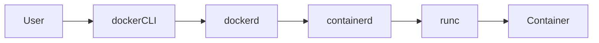

​`dockerd` 是 Docker 的核心组件，负责管理 Docker 的所有底层操作（如容器生命周期、镜像存储、网络通信等）。它类似于一个“后台服务”，持续运行并响应来自用户或客户端的请求。

---

## ​**​`dockerd` 是什么？​**​

 ​**​1. 定义​**​

- ​**​`dockerd`​**​（Docker Daemon）是 Docker 的​**​守护进程​**​，常驻后台运行。
- 它是 Docker 引擎的核心，直接与操作系统内核交互（通过 `containerd` 和 `runc` 等组件）。
- 默认监听 Unix 套接字（`/var/run/docker.sock`）或 TCP 端口（如 `2375`）。

​**​2. 类比解释​**​

- 类似 ​**​Web 服务器​**​（如 Nginx）的后台进程，默默处理请求。
- 用户通过 `docker` 命令行工具（CLI）发送指令，`dockerd` 实际执行这些指令。

---

## ​**​`dockerd` 的核心职责​**​

|​**​功能​**​|​**​说明​**​|
|---|---|
|​**​容器管理​**​|创建、启动、停止、删除容器。|
|​**​镜像管理​**​|拉取、构建、存储镜像（如 `docker pull` 或 `docker build`）。|
|​**​网络管理​**​|配置容器网络（如桥接网络、Overlay 网络）。|
|​**​数据卷管理​**​|挂载和持久化数据（Volume/Bind Mount）。|
|​**​API 服务​**​|提供 RESTful API，供 `docker` CLI 或其他工具（如 Kubernetes）调用。|

---

## ​**​`dockerd` 的工作流程​**​

1. ​**​用户输入命令​**​：
    
    ```
    docker run -d nginx
    ```
    
2. ​**​CLI 发送请求​**​：`docker` 命令行工具将指令通过 API 发送给 `dockerd`。
3. ​**​守护进程处理​**​：
    - 检查本地是否有 `nginx` 镜像，若无则从仓库拉取。
    - 调用 `containerd` 和 `runc` 创建容器进程。
    - 配置网络和存储。
4. ​**​返回结果​**​：将容器 ID 或错误信息返回给 CLI。

---

## ​**​如何控制 `dockerd`？​**​

**​1. 启动/停止服务​**​

```sh
# Linux（Systemd）
sudo systemctl start docker   # 启动
sudo systemctl stop docker    # 停止
sudo systemctl restart docker # 重启

# macOS/Windows（Docker Desktop）
通过 GUI 或菜单控制。
```

**​2. 查看运行状态​**​

```sh
sudo systemctl status docker  # Linux
dockerd --version            # 查看版本
```

**3. 调试模式​**​

```sh
# 手动启动 dockerd 并输出调试日志
sudo dockerd --debug
```

---

## ​**​`dockerd` 的配置文件​**​

**​1. `daemon.json`​**​

- ​**​路径​**​：`/etc/docker/daemon.json`
- ​**​作用​**​：全局配置 `dockerd` 的行为（如日志驱动、存储路径等）。
- ​**​示例​**​：
    
    ```json
    {
      "log-driver": "json-file",
      "data-root": "/mnt/docker-data"
    }
    ```
    

**​2. 启动参数​**​

- 通过 `dockerd` 命令行参数或 Systemd 的 `override.conf` 文件覆盖默认配置。
- ​**​示例​**​：
    
    ```conf
    # /etc/systemd/system/docker.service.d/override.conf
    [Service]
    ExecStart=/usr/bin/dockerd --insecure-registry my-registry:5000
    ```
    

---

## ​**​`dockerd` 与相关组件的关系​**​



- ​**​`docker` CLI​**​：用户交互界面。
- ​**​`dockerd`​**​：核心引擎，处理请求并调度资源。
- ​**​`containerd`​**​：管理容器生命周期（实际创建/停止容器）。
- ​**​`runc`​**​：底层工具，根据 OCI 标准运行容器进程。

---

## ​**​常见问题​**​

**​Q1: `dockerd` 和 `docker` 命令的区别？​**​

- `dockerd` 是​**​后台服务​**​，负责实际工作。
- `docker` 是​**​客户端工具​**​，将用户指令转发给 `dockerd`。

**​Q2: 为什么修改 `daemon.json` 后要重启 `dockerd`？​**​

因为 `dockerd` 只在启动时加载配置，重启才能应用变更。

​**​Q3: 如何连接远程 `dockerd`？​**​

在客户端设置环境变量：

```sh
export DOCKER_HOST=tcp://远程IP:2375
```

---

## ​**​总结​**​

- `dockerd` 是 Docker 的“大脑”，​**​无守护进程 = 无 Docker 服务​**​。
- 通过 `daemon.json` 和 Systemd 管理其行为，生产环境需关注安全和性能配置。
- 理解 `dockerd` 的工作机制，能更高效地调试容器问题！ 🐳